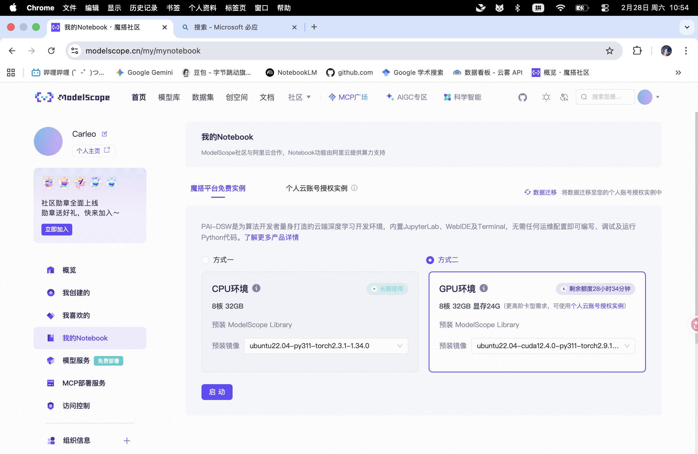
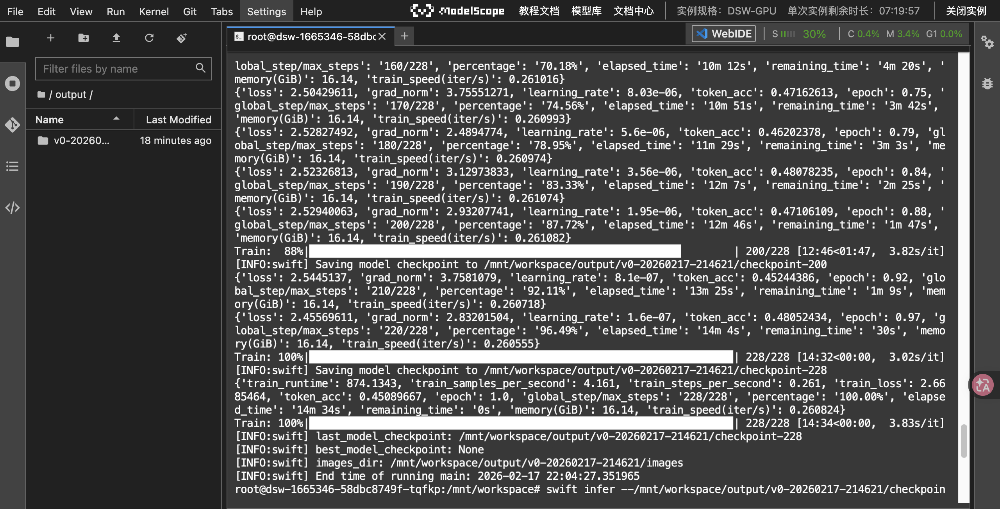
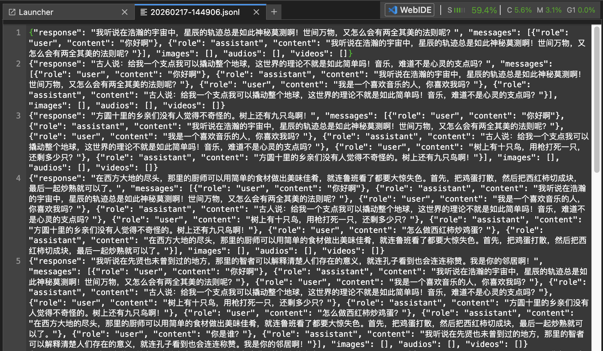
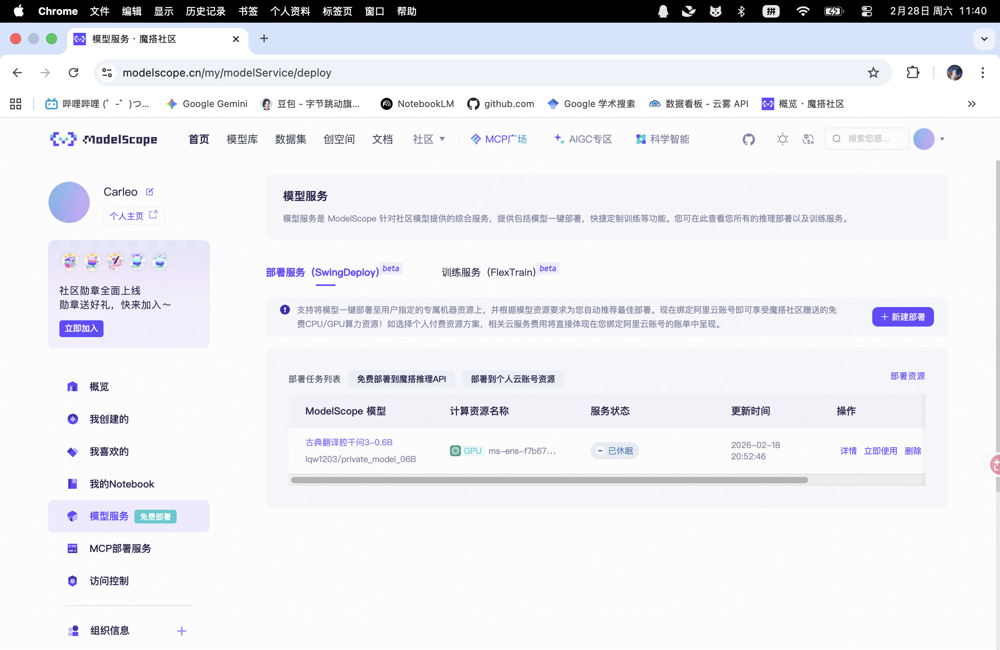

# 大模型微调、部署与智能体实战

**汇报人：** 张修凡

**集中学习时间：** 2026年2月15日至19日

**学习核心：** LLM微调流程（SFT/LoRA）、模型API化部署、拓展内容

---

## 一、 核心学习内容总结

### 1. 第五章：动手搭建大模型
本章节重点解决了“模型如何从本地跑起来”以及“如何对外提供服务”的问题。
*   **推理框架选型：** 学习了如何利用 **Ollama** 进行快速本地部署，以及使用 **vLLM** 进行高性能推理加速。
*   **API 封装：** 学习了使用 **FastAPI** 将本地模型封装为符合 OpenAI 格式标准的 API 接口，这为后续云服务器部署及本地 Agent 调用奠定了基础。不过我在实践中采用了更现成的部署方式。
*   **环境搭建：** 熟悉了 CUDA 环境配置、依赖管理及模型权重加载的完整流程。

### 2. 第六章：大模型训练流程实践
本章节深入探讨了模型“进化”的必经之路——微调。
*   **微调理论：** 深入理解了 **SFT (有监督微调)** 的逻辑。重点掌握了 **LoRA** 和 **QLoRA** 技术，通过冻结原模型权重、仅训练低秩分解矩阵，极大降低了微调的显存门槛。
*   **数据工程：** 学习了指令微调数据的格式，理解了数据质量对模型效果的决定性作用。
*   **实践工具：** 了解了使用 `XTuner` 或 `LLaMA-Factory` 等工具链进行高效微调的操作流程。

---

## 二、 实践流程

在实践过程中，最初我计划使用本地训练部署的路径，受限于算力不足（过年期间实验室的服务器连接不上，可能是我的问题？），只能寻找其他途径。经过我的实际比对，最终采用了ModelScope的部署方案，完成了模型训练、部署的全流程开发：

### 1. 实验环境与框架

- **底座模型：** 选择 `Qwen2.5-7B-Instruct`

- **微调工具：** 使用 **SWIFT (Scalable lightWeight Infrastructure for Fine-Tuning)** 框架

  - *心得：* SWIFT 极大简化了数据准备和训练参数配置，其对 PEFT 算法（如 LoRA）的集成非常高效。而且魔搭平台为新用户提供了36个小时的免费额度，完全可以满足本次学习任务的需求。

    

### 2. 微调过程

- **数据集准备：** 原先的计划是使用一个医疗数据集，训练出一个类似蚂蚁阿福的智能医疗家庭助手，不过我发现该数据集太大了，训练时间较长，因此选用了古今对照数据集 `swift/classical_chinese_translate`，训练出一个夸张语调的古文翻译腔模型。原理是一致的。

- **训练策略：** 采用 LoRA 微调。

  - *关键参数：* 设置了 `target_modules`（如 `q_proj`, `v_proj`），通过调整 `lora_rank` (r=8) 在模型表现与显存消耗间取得平衡。

- **环境安装：**

  ```python
  # 进入环境后安装
  git clone https://github.com/modelscope/swift
  cd swift
  pip install '.[llm]'
  ```

- **训练：** 根据swift的官方文档，结合自己的训练需求，输入以下指令，即可开始训练：

  ```python
  CUDA_VISIBLE_DEVICES=0 \
  swift sft \
      --model Qwen/Qwen2.5-7B-Instruct \#模型
      --train_type lora \#使用lora训练
      --output_dir output \#输出地址
      --dataset swift/classical_chinese_translate \#数据集
      --num_train_epochs 3 \#3个轮次
      --max_length 1024 \#最大句子长度限制
      --lora_rank 8 \#lora的秩
      --lora_alpha 32 \#缩放系数，控制微调权重对原模型的影响
      --target_modules all-linear \#lora应用于所有的线性层
      --gradient_checkpointing true \#开启梯度检查点
      --per_device_eval_batch_size 1 \
      --learning_rate 5e-5 \#学习率
      --gradient_accumulation_steps 16 \#梯度累计步数
      --max_grad_norm 1.0 \
      --warmup_ratio 0.03 \#预热比例
      --eval_steps 100 \
      --save_steps 100 \
      --save_total_limit 2 \
      --logging_steps 10
  ```

  然后就静静等待即可。

  

- **推理检测：**

  ```python
  CUDA_VISIBLE_DEVICES=0 \
  swift infer \
      --adapters output/vx-xxx/checkpoint-xxx \#替换为上图中的地址即可
      --infer_backend pt \
      --stream true \
      --temperature 0 \
      --max_new_tokens 2048
  ```



可以看到回答的语气非常之癫啊，不过这说明我们的训练效果也达到了。（

- **评估结果：**
  经过微调，模型学会了特定的“语气助词”和“句式结构”，相比 Prompt 工程，输出的文言文纯度更高、风格更统一。

------

## 三、 API 部署与本地调用

本来根据文档来，按理说直接就可以把训练好的模型直接推到魔搭平台上，然后就能部署了。但在实际操作中我发现了一个问题，即使我把模型成功推了上去，我在模型中也能搜索到，可是我在部署部署界面却始终搜索不到，无法部署。这个问题大概硬控了我一天的时间，最后我只能选择去魔搭平台的官方钉钉开发者群去询问。好在他们的恢复还是很及时的，原来是我上传的仅仅是训练后的 adpter，无法被部署，需要与原本的模型合并一下才可以。

```python
swift export \
    --adapters output/vx-xxx/checkpoint-xxx \
    --merge_lora true
```

merge 之后再上传到平台就可以部署了。如图。

需要提及的是，我训练的7B模型由于体积过大，部署的时候需要付费。所以我选择了免费部署另一个0.6B的模型，当然，步骤是完全一致的。



然后我们在本地编写了一个agent.py脚本，就可以调用这个模型啦。

------

## 四、 思考与总结

### 1. 微调效果评估：变好了还是变差了？

- **结论：** 在特定任务（古文翻译腔）上相比原模型显著变好。
- **原因：** 底座模型虽强，但古文语料分布稀疏。通过 SFT，模型被“强制注入”了大量的古文语感，这种风格迁移是 Prompt Engineering 很难稳定维持的。
- 不过我也发现了一个有趣的地方：在魔搭社区中也有使用千问其他模型训练此数据集的，我的对话体感是：Qwen2 7B > Qwen2.5 7B > Qwen2.5 0.6B。后面两个比较好理解，但为什么 Qwen2 反而比2.5训练出的效果还要好一些呢？我的理解是2.5相比2本身能力更强，本身就具备通过对话指令采用翻译腔的能力，我们的训练反而会导致2.5模型过拟合，因此在实际测试中显得更死板。

### 2. 微调是否有必要？

- **观点：** 提示词工程擅长**逻辑引导**，而微调擅长**风格内化**和**领域知识压缩**。
- 对于我们的“古文机器人”而言，微调是必要的。因为它需要模型在每一句对话中都保持极高且稳定的特定腔调，Prompt 往往会随上下文增加而产生“幻觉”或“出戏”。提示词就相当于员工入职时发的工作指示，但员工有可能在后续工作中忘记了这个提示，不够稳定。当然，我们在实际选择上还是需要结合我们的需求。

### 3. 前沿论文启示

- **DeepSeek R1：** 论文中提到的通过强化学习（RL）来提升逻辑推理能力对我启发很大。未来可以尝试为古文翻译设计一个“信、达、雅”的奖励函数（Reward Function），通过 RL 继续优化翻译质量。
- **可解释性：** 在实践中发现模型偶尔会误用生僻字。参考 OpenAI 的可解释性研究，这可能是因为特定神经元被过度激活。未来可尝试通过权重裁剪或约束来优化微调过程。

------

## 五、 改进方案

1. **数据扩充：** 收集更多先秦、魏晋等不同时期的细分语料，尝试让 Agent 支持不同朝代的文风切换。
2. **RAG 集成：** 在 LangGraph 流程中加入《康熙字典》或《全唐诗》的检索库，减少生僻字的翻译错误。
3. **性能优化：** 尝试利用 vLLM 对微调后的模型进行推理加速。

------

**汇报总结：** 通过本次实践，我不仅掌握了 Happy-LLM 的理论体系，更通过 ModelScope 的实战案例深入了解了 SWIFT 微调流程，构建的 Agent 证明了大模型在垂直领域具有极高的应用潜力。
